# Graphics Experiments - DirectX 11, Luna (Legacy)
A collection of small real-time rendering experiments built with DirectX 11, Luna framework (a teaching framework used in Frank Luna's DX 11 book). The goal of this repo is to have a sandbox to explore how rendering works under the hood: meshes, textures, shaders, lighting, and the GPU pipeline, from scratch and manually. Each project is self-contained and showcases a specific graphics concept or workflow.

---

## Contents

### [PyramidGenerator](./PyramidGenerator)
A series of experiments exploring how to render and manipulate a pyramid mesh with increasing complexity. Demonstrates procedural mesh generation, parameter manipulation and geometry shader usage. 
- **Basic**: manually builds and renders a parameterized pyramid. 
- **Interactive**: uses inputs to change parameters used to render the pyramid (height, radius, amount of sides).
- **GeometryShader**: same setup but generated and expanded using a geometry shader. 

  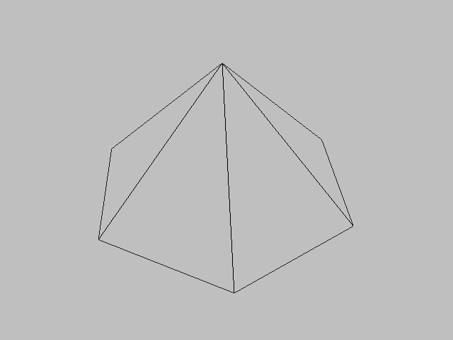
  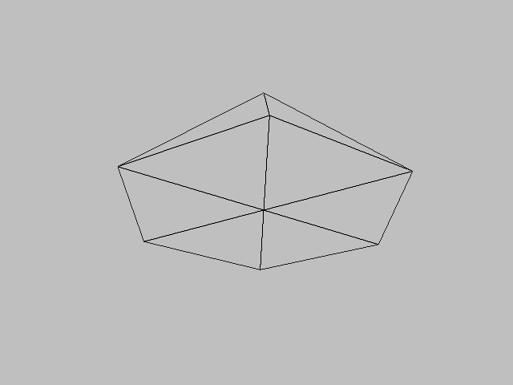

### [DynamicTexturedPhone](./DynamicTexturedPhone)
Experiments in texturing a phone-like mesh, progressing from static to dynamic render-to-texture workflows. Explores multi-texturing, UV mapping, and render-to-texture techniques on a small mesh.
- **TexturedPhone**: generates and renders a mesh that looks like a phone, textured with basic uv mapping using pictures of all sides of a real phone.   
- **ScreenUV**: applies a second texture with multi-texturing and custom UVs, which is mapped to the phone screen as if the phone shows a picture.  
- **CameraRenderTexture**: renders the scene to a texture displayed on the phone screen, using render-to-texture techniques.

  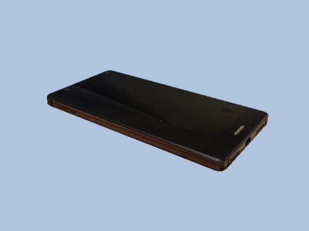
  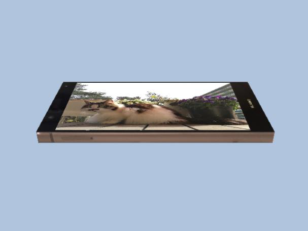
  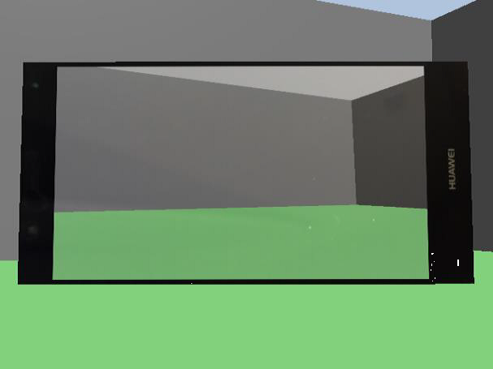

### [Fresnel](./Fresnel)
Custom implementation of a fresnel shader, calculating the pixel color based on the normal of the pixel and the camera and parameters to control colors and intensities.

  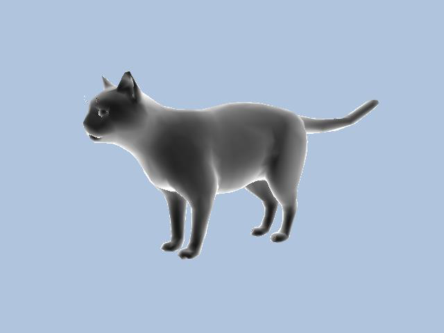
  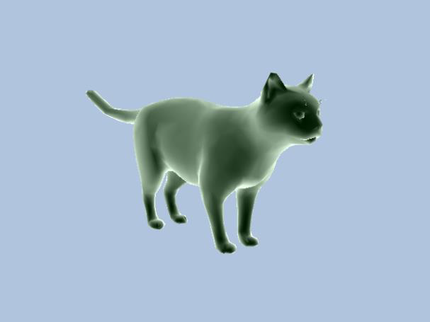

### [LightingExperiments](./LightingExperiments)
A collection of small interactive lighting experiments, exploring basic functionality of point and spot lights. 
- **PointLightWand**: simulates a wand emitting a controllable point light, inspired by "Lumos". 
- **SpotLightLaser**: a spotlight attached to the camera shines on the environment much like a laser.
- **PointLightUnderwater**: simulates a point light on the bottom of a body of water. Uses a lightmap to simulate water distortion effects.    

  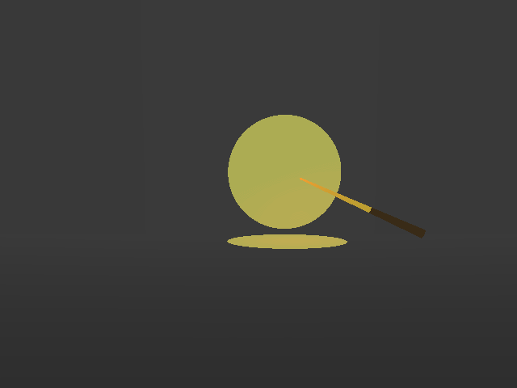
  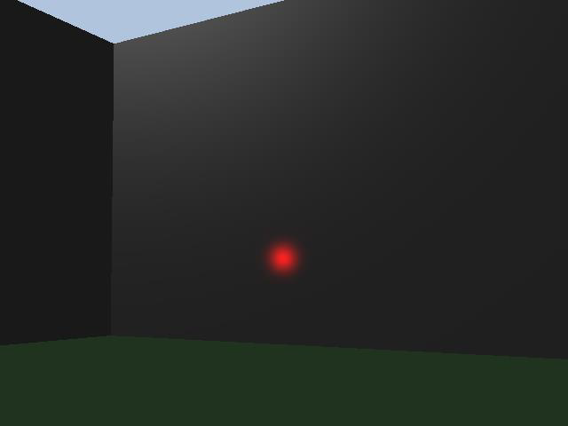
  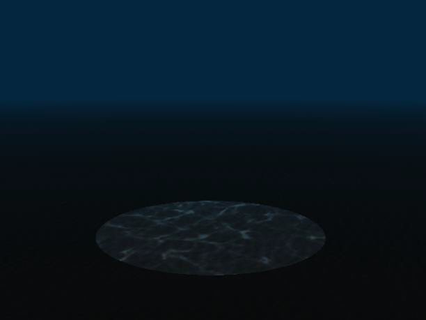

### [ReflectiveChrome](./ReflectiveChrome)
Custom implementation of a real-time reflective surface using dynamic cube mapping, with dynamic reflectiveness based on user inputs. 

  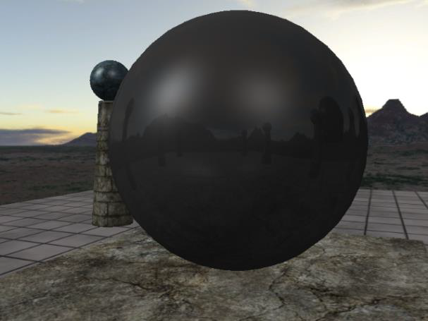
  

### [TranslateShadertoyToDX11](./TranslateShadertoyToDX11)
An excercise in translating ShaderToy shaders to DirectX 11. Shader [isovalues 2](https://www.shadertoy.com/view/MdfcRS) was translated from GLSL to HLSL, adapted to the DirectX 11 development environment.  

  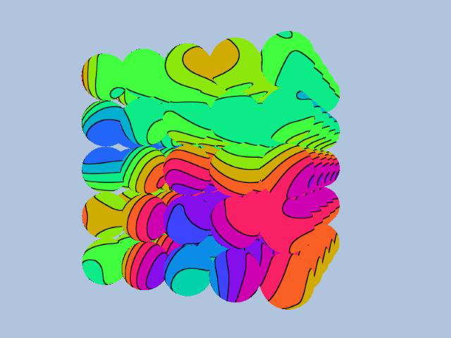

---

## Notes

- ⚠️ This project **cannot be built** on modern systems due to the requirements for VS2010, DX11 SDK and Luna. The pre-built Luna libraries are not compatible with VS2022+. 
- Screenshots are provided for quick previews. Sadly, builds cannot be provided. 
- This repository is used as a sandbox environment to experiment with real-time graphics programming, to showcase my work and to reference examples in conversation or lectures. 

